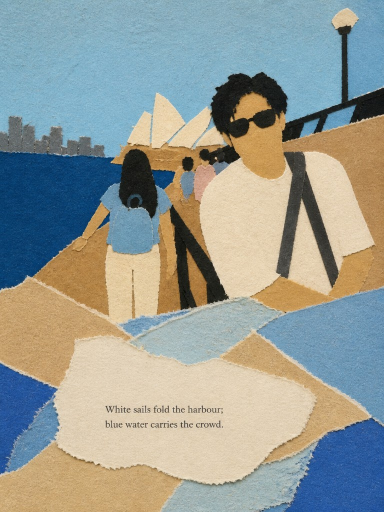
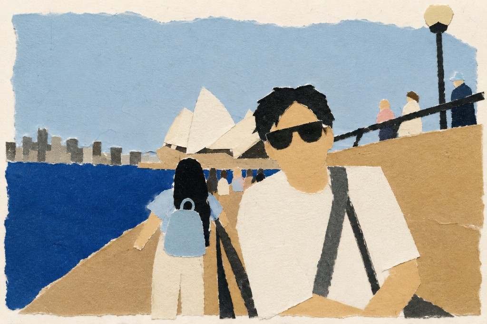

# Hand-Drawn Collage

把一张日常照片，收成一页极简手绘拼贴。

给 **Codex + image2** 用的生图 Skill。上传照片，调用 `$hand-drawn-collage`，选择 A / B / C，直接出图。不需要在仓库里配置 key。

## 三种版本

| | A 诗句留白 | B 纯手绘 | C 原图对照 |
| --- | --- | --- | --- |
| **成图** | 上半手绘，下半留白 + 诗 | 整张手绘，无字 | 上半原图，下半纸底拼贴 + 诗 |
| **尺寸** | 原图 `W:H` → `W:2H`，上下各一半 | 与原图相同 `W:H` | 原图 `W:H` → `W:2H`，上下各一半 |
| **例子** | 4:3 → 4:6；16:9 → 16:18 | 16:9 仍是 16:9 | 4:3 → 4:6；16:9 → 16:18 |

诗根据图中要素写。手绘要高度抽象：色块和剪影，不要照片滤镜。A 是一整页撕纸拼贴，不要上下两栏加白线。C 的上半必须是原图像素。

## 安装

```bash
git clone https://github.com/Xuqser/hand-drawn-collage.git ~/.codex/skills/hand-drawn-collage
```

Skill 没有立刻出现时，重启 Codex。

## 使用

在带 image2 的 Codex 里新开对话，上传照片：

```text
使用 $hand-drawn-collage，做版本 A：诗句留白版。
```

```text
使用 $hand-drawn-collage，做版本 B：纯手绘版。
```

```text
使用 $hand-drawn-collage，做版本 C：原图对照。
```

不必写出衣服颜色。只有特别想锁定某几件时再补一句。

同一张图可以分三次对话各跑 A、B、C，方便对比。

## 生图效果

同一张悉尼港照片，当前版本的 C / A / B：

### C · 原图对照

上半是原图，下半是纸底上的一小簇手绘和诗。


### A · 诗句留白

一整页撕纸拼贴，诗写在下方不规则纸片上。



### B · 纯手绘

整幅都是手绘，不留排版区，没有文字。



## 仓库结构

```text
hand-drawn-collage/
├── README.md
├── SKILL.md
├── agents/openai.yaml
├── examples/
│   ├── version-a.png
│   ├── version-b.png
│   └── version-c.png
└── references/
    ├── prompt-templates.md
    ├── shared-clauses.md
    ├── version-a.md
    ├── version-b.md
    └── version-c.md
```

## 关于照片

只把用户这一轮上传的照片当作参考。除非用户要求，不要保存、分享或另行上传原图。`examples/` 里是作者提供的效果样张，仅用于说明三种版本。
